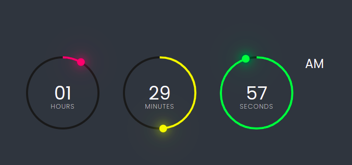

# clockApp

## [Visitar Web](https://josecossi89.github.io/Weather-App/)

## Tecnologias usadas

```
HTML5
CSS3
JavaScript
```

---

<h2 align="center" style="color: #9f9f09; font-weight: bold;"> ¡Conozcamos un poco la app! </h2>

---

## _Clock App_

<p align="center">
  
</p>
